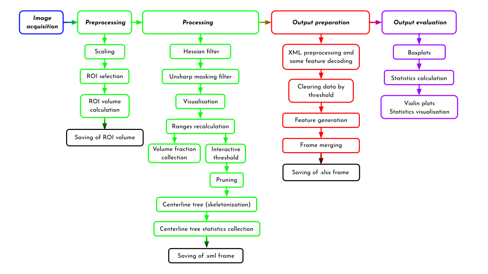

# OA-pipeline
The provided Python script is a pipeline for processing and analyzing images of vascularization using the Thermo Fisher Scientific Amira / Avizo 3D Visualization & Analysis Software (2022.2). It applies a series of filters and processing techniques to enhance medical image data and extract
meaningful information. It utilizes features provided by the Amira / Avizo software to perform these operations and save the results for further analysis.



Here we want to describe how our pipeline could be implemented to characterize 3D images of vascularisation.
---
***Image preprocessing***
>1. NIfTI dimentions converter  
>  1.1. Uploads file from 'folder_path'  
>  1.2. Returns converted files to 'out_path' folder

The **'matlab_script_converter_nifti'**, **'folder_path'** and **'out_path'** need to be defined.  
The script retrieves a list of files from a specified directory. 
It uploads files from 'folder_path', converts them using Nifti dimentions converter - a MATLAB script that allows file conversion into the .nii format.  
Upon conversion the script returns the converted files to 'out_path' folder.

>2. Paths and tags  
  2.1. Define the path to the folder with images  
  2.2. Select the files of interest by specifying the 'tag'  

During this step we can select the files of interest by specifying the 'tag', which should be a part of the file name. This function creates a new folder with the name specified by the tag parameter within the given folder path.

>3. Image preparation  
  3.1. Provide the path and tag of files to the Avizo console  
  3.2. Run the cell and paste the following text output into Avizo console 
 
After the images are sorted into a separate folder according to the tag, we can move to the Image preparation  which includes providing the path and tag of files to the Avizo console and ROI selection.

>4. ROI preselection  
  4.1. Paste the following code into Avizo console

This step uploads the sorted images from the folder created in the previous step and performs Volume Rendering.

>5. Manual selection of ROI  
  5.1. Select ROI of your choice  
  5.2. Create mask using the 'Volume Edit' tool in Avizo

You can manually select the desired ROI, which will be cut from the image, and create a mask with the 'Volume Edit' tool. This mask will be saved in a separate folder in the next step:

>6. Saving  
  6.1. Paste the following code into Avizo console

The first part of this pipeline is then complete with clearing of the project view window in Avizo and prepare it for the next step:

>7. Clear 'Project view' in Avizo  
  7.1. Clear and restart the Python console  
  7.2. Copy the new_path and tag into the Avizo console again (see beginning of Step 2)

---

***Image processing*** 
>8. Process the image and save the results
>   
>    Warning: this step requires computer resources.    
>    We do not recommend to upload stacks of large images.
>   
>    8.1. For images with other extentions:   
>    8.2. Change the 'extention' variable   
>    8.3. Paste the following code into Avizo console

By default the extension is set to .nii but it can be changed to your desired file type, such as .modif, .tiff, etc.

>    Filter settings can be adjusted with respect to your image properties    
>    See the settings below    

The filters we provide for our pipeline can be modified with the following settings:             

**'number_of_images_for_threshold'** is a function that sets a number of images in the series for threshold calculation.  
It allows you either to define different thresholds for every single image or define the threshold for one image by specifying the **thr** tag in image name and then apply it to all the other images in the series.   

If **number_of_images_for_threshold** = 0, the threshold will be calculated for each image

### Method for calculating threshold in Amira / Avizo software for correct display and correct validation:


To avoid the common error of Avizo auto-threshold setting, we preform the shift of the frame to the histogram values that will allow for proper visualization.

**'first_point_shift' [1]** defines the percentage by which the left autorange limit is moved.  
Left range limit recalculated as:  
```math
Left\_lim\_shift = default\_autorange - default\_autorange \times first\_point\_shift  
```

**'second_point_shift' [2]** defines the percentage by which the right autorange limit is moved.  
Right range limit recalculated as:  
```math
Right\_lim\_shift = default\_autorange - default\_autorange \times second\_point\_shift  
```

**'multiplier_for_frameshift_of_volren' [3]** it is a multiplier that performs the range frameshift for the 'Volume Rendering' filter  
If the image is too bright, the settings can be adjusted respectively


**'threshold_multiplier' [4]**  Threshold shift multiplier allows to avoid noise and mess. It removes ranges from ranges frame that are visualized by **'threshold_multiplier'**.  
Both ranges recalculated as: 
```math

Result = (([1] \, \text{or} \, [2]) \times ranges\_from\_autothreshold \times [3]) \times [4]

```


For each image we apply a **Hessian filter** to enhance the image structure.  

We apply the Hessian filte to a 3D image, it is used to detect and highlight textural features and structures in volumetric data. In our case it is used to enhance the tubular and elongated structures of the blood vessels. It is based on the computation of the Hessian, which is a matrix of second partial derivatives of image intensity. In a 3D image, Hessian matrix is calculated from each point representing a volumetric voxel (similar to a pixel in 2D) of the input image. The Hessian filter can help identify volumetric textural features (such as rod-like vessels structure), reflecting the changes of the intensity in different directions around a specific point.
[Dirk-Jan Kroon (2023). Hessian based Frangi Vesselness filter (https://www.mathworks.com/matlabcentral/fileexchange/24409-hessian-based-frangi-vesselness-filter) ]. 

To vary Hessian filter settings you need to specify **'hessian_filter'** parameters according to comments in the python notebook for the series of NIfTI images you would like to process.
**MAX** and **MIN** are the maximum and minimum radius of the structure respectively (shown in voxels). **STD** (shown in voxels) represents the standart deviation of the measurement that we use to identify our object. It is preferable for the STD value to be > voxel size.  

---
Next, we apply the **Unsharp masking filter** to further enhance image details.
This filter is applied to reduce the impact of noise and to preserve the fine structures that can be easily lost in subsequent stages of image processing. It works by applying a smoothing filter to the original image to create its blurred version. After that, the original image is subtracted from the blurred image to enhance the contrast and sharpness of the blood vessel edges. The edge size and the edge contrast must be adjusted in accordance with the image analyzed.

The filtered files are renamed to indicate the applied filters.

---
**Volume rendering** is further performed on the filtered files.
Ranges for intensity rendering are collected to determine appropriate rendering ranges for each file.
The volume rendering parameters are adjusted based on the autoranges and then recalculated for appropriate image display.

---
**Interactive thresholding** is applied to the filtered files using the adjusted ranges for threshold rendering thus separating desired structures from the background.  

Also we can vary the threshold mode to specify it automatically or related to root images used for threshold recalculation.  

After **Interactive thresholding** we work with binary image.

---
**Pruning filtering** and **Centrline tree** reconstruction are performed on the thresholded binary images.

**Pruning filter.** The filter processes the dataset and applies the specified criteria to determine which structures or objects should be removed. 
Unwanted structures or objects that fall below the specified criteria are eliminated from the dataset.  

To perform the pruning, the algorithm visits each voxel object of the binary image and prunes the visited object from the image.

A certain number of pruning iterations **'pruning.ports.numberOfIterations.texts[0].value'** can be set.

**Centerline tree reconstruction.** This tool is used for extracting and visualizing the central axes of the blood vessels. 

**'centrline_tree.ports.tubesParams.texts[0].value'** Centrline tree Slope is a penalty parameter that is responsible for creating a loop-like branch. 

**'centrline_tree.ports.tubesParams.texts[1].value'** Centrline tree ZeroVal is a penalty that is responsible for creating a straight branch.   
However, if you reduce the ZeroVal, it will not result in merging of small fragments into a bigger one but, on the contrary,  
some of the small segments will be ignored to escape the penalty increase.  

>    8.4. Press 'Autosave' in Avizo to save project     
>    8.5. Save .XML files to the folder with images     

---

>9. Script for reading and filtering (denoising) the .XML output from Avizo
>    
>    9.1. Set 'file_path' to a folder of your choice with .XML data  
>    9.2. Define the 'pattern' variable to get an appropriate title for 'Condition' labeling    
>    9.3. Define the 'selector' and select the column name to apply a threshold to remove the noise from the data.  
>    9.4. Define 'threshold' variable for better results

In this step we have to select an appropriate threshold according to the smallest value of **'Curvedlength'** in the output .xml.  
This step is to avoid noise like two- or three-voxel meaningless branches.

>10. Creation of datasets with a defined order
>    
>    10.1. Define the dataset order for merging  
>    (e.g. if there are 4 datasets that need to be splitted into two groups (based on filename), specify 2, 2 in merging_order    
>    10.2. Merging allows to create dataframes that are specifically suited for your sampling conditions  
>    10.3. One of the outputs is a merged DataFrame that contains a column named 'conditions' with the filenames of all the images that were analyzed  
>    10.4. The other one is 'mean' dataset according to the 'merging order' and mode  
>    10.5. This dataset we save in .xlsx format, that are easy to analyse  

### Dataset features:

**CurvedLength** : Curved lenth [nm] of the skeletonized vessel segment.  

**MeanRadius** : Mean radius [nm] of the skeletonized vessel segment.  

**Volume** : Volume [nm^3]  of the skeletonized vessel segment.  

**OrientationTheta** : Topological parameter of the segment orientation relative to the coordinate axis.
The angle between a horizontal plane and a plane perpendicular to the object's principal axis.
It can vary from -90 to 90 degrees and is used to determine the vertical orientation of an object.

**OrientationPhi** : Topological parameter of the segment orientation relative to the coordinate axis.
The angle between the horizontal plane and the plane in which the main axis of the object lies.
It can vary from 0 to 360 degrees and is used to determine the horizontal orientation of an object.

**ChordLength** : The vector length from the first to the last segment point, which does not take the curvature into the account.

**Tortuosity** : Vessels Tortuosity of the skeletonized vessel segment. Calculated as:
```math
Tortuosity = \frac{CurvedLength}{ChordLength} 
```

**Number of empty endpoints** :  The number of the end points of all the segments that do not contact any other segments. Trash segments not accounted for.

**Number of branchpoints** : The number of points at which the object branches or has more than one neighbor.

**Max Coordination Number** : The maximum number of branchpoints at some point in the image.

**Volume_Sum_perImage [um^3]** : The sum of volume for all the segments in the image [µm^3]. Calculated as:
```math
dataset['Volume\_Sum\_perImage [um^3]'] = \frac{volume\_sum}{10^9} 
```

**Geometrical_Volume_perImage [um^3]** : The sum of all the segment volumes in the image [µm^3], based on the assumption that each vessel segment is a cylinder. Calculated as the geometrical volume of all the cylindrical segments using the **'CurvedLength'** and **'MeanRadius'**. Provided to avoid segmentation and imaging error.
```math
dataset['Geometrical\_Volume\_perImage [um^3]'] = \frac{\sum_{i} (MeanRadius_i)^2 \pi CurvedLength_i}{10^9} 
```

**Imaging_Error_perImage** : The ratio of the **'Geometrical_Volume_perImage'** to the **'Volume_Sum_perImage'**. Calculated as:
```math
dataset['Imaging\_Error\_perImage'] = 1 - \frac{Geometrical\_Volume\_perImage [um^3]}{Volume\_Sum\_perImage [um^3]}
```

**Vessels_CurvedLength_Sum_perImage [um]** : Sum of all **'CurvedLength'** per image [µm]. Calculated as:
```math
curvedlength\_sum = \sum_{i} CurvedLength_i
dataset['Vessels\_CurvedLength\_Sum\_perImage [um]'] = \frac{curvedlength\_sum}{1000}
```

**Weighted_MeanRadius_perImage [um]** : **'MeanRadius'** per each image according to **'CurvedLength'**. Calculated as:
```math
dataset['Weighted\_MeanRadius\_perImage [um]'] = \frac{\sum_{i} MeanRadius_i \cdot CurvedLength_i}{curvedlength\_sum \cdot 1000}
```

**Weighted_MeanTortuosity_perImage** : **'MeanTortuosity'** per each image according to **'CurvedLength'**. Calculated as:       
```math
dataset['Weighted\_MeanTortuosity\_perImage'] = \frac{\sum_{i} Tortuosity_i \cdot CurvedLength_i}{curvedlength\_sum}
```

**Weighted_Segment_MeanRadius_perSegment [um]** : Weighted by **'CurvedLength'** value of **'MeanRadius'** calculated for each segment. Calculated as:
```math
dataset['Weighted\_Segment\_MeanRadius\_perSegment [um]'] = \frac{MeanRadius_i \cdot CurvedLength_i}{curvedlength\_sum \cdot 1000} 
```

**Weighted_Segment_Volume_perSegment [um^3]** : Weighted by **'CurvedLength'** value of **'Volume'** calculated for each segment.  Calculated as:  
```math
dataset['Weighted\_Segment\_Volume\_perSegment [um^3]'] = \frac{Volume_i \cdot CurvedLength_i}{curvedlength\_sum}
```

### Frame for export features

**Total Image Volume [nm^3]** : The volume of all voxels per image calculated according to the total image dimensions  [nm^3].  

**ROI Volume [nm^3]** :  The volume of all voxels per selected ROI calculated according to the total ROI dimensions  [nm^3].

**Vessels in ROI Volume (Labeled Volume after pruning before denoizing) [nm^3]** : The volume of all the vessel segments per manually selected ROI  [nm^3]. The value extracted from Binary mask before skeletonization.

**Ratio of ROI Mask to whole image** : The ratio of ROI mask volume to the whole image volume.   

**Ratio of Vessel Mask to whole image** : The ratio of Vessel mask volume to the whole image volume.   

**Ratio of Vessel Mask to background ROI** : The ratio of Vessel mask volume to the background ROI volume.     

---


>    Output dataframes:


**frame_for_export**

>    Consists of 'mean' by dataframe observation.
>    Each observation defined by sample group was provided in merging.

**one_big_merged_frame**

>    Consists of all dataframes with column 'Condition', where the sample names are presented


>11. Boxplots for all samples with respective stats and annotations
>    Here we work with 'one_big_merged_frame' dataset

>    Makes plots according to 'Condition' column and our groups

---

Statistics are collected using **Spatial Graph Statistics** on the **Centrline tree** calculations results.

In this step we build box plots and violin plots allowing you to collect statistics for your data in semi-automatic mode, using statistical criteria of your choice.

---
The project is autosaved in **Amira/Avizo** format.

---
Attribute graphs generated by **Spatial Graph Statistics** are exported as XML files.

---


Package                  Version
---------------------------------
et-xmlfile 	 (>= 1.1.0)  
matplotlib 	 (>= 3.6.2)  
numpy 		   (>=1.23.4)  
openpyxl 	   (>= 3.1.2)  
pandas  	   (>= 1.5.2)  
scipy 		   (>= 1.10.0)  
seaborn	     (>= 0.12.1)  
Statannot 	 (>= 0.2.3)  
XlsxWriter 	 (>= 3.1.3)  
Xmltodict 	 (>= 0.13.0)  
```
#!pip install et-xmlfile==1.1.0
#!pip install matplotlib==3.6.2
#!pip install numpy==1.23.4
#!pip install openpyxl==3.1.2
#!pip install pandas==1.5.2
#!pip install scipy==1.10.0
#!pip install seaborn==0.12.1
#!pip install Statannot==0.2.3
#!pip install XlsxWriter==3.1.3
#!pip install Xmltodict==0.13.0
```

